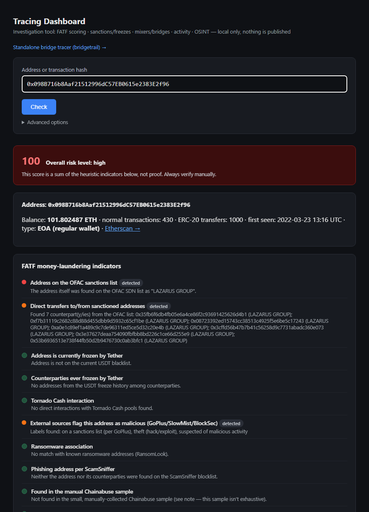

# Tracing Dashboard

A local, single-page tool for checking crypto wallets. Paste in an
Ethereum address, a transaction hash, or any other string (BTC/TRON/Solana
address, etc.) and it checks the wallet against everything available from
public sources, on one page:

- 🚩 an AML/FATF-style red-flag risk score
- 🧊 sanctions and freeze screening
- 🌉 mixer and cross-chain bridge tracing
- 📊 an activity heatmap and the largest transactions/counterparties
- 🔎 OSINT from scam-report databases and the open web

Runs entirely on `127.0.0.1`. Nothing is sent anywhere except the read-only
API calls documented below.

> **This is a heuristic triage tool, not a verdict.** Every flag it raises
> is a reason to look closer, not proof of wrongdoing. Always verify
> manually before treating any finding as fact — see
> [Limitations](#limitations--disclaimers) below.

## Screenshot

Checking a public, OFAC-sanctioned Lazarus Group address — direct sanctions
hit, sanctioned counterparties found on-chain, and an external malicious-
address label, all surfaced automatically:



## Features

| | |
|---|---|
| 🚩 **FATF-style red-flag scoring** | Mixer usage · sanctioned/frozen counterparties · structuring (amounts just under reporting thresholds) · rapid pass-through ("mule") behavior · a fresh wallet with an immediately large turnover · abnormal counterparty fan-out · round-numbered amounts |
| 🧊 **Sanctions & freeze screening** | OFAC SDN list · live and historical Tether (USDT) blacklist status · ScamSniffer's phishing blocklist |
| 🛰️ **External threat intel** | GoPlus Security (aggregates GoPlus/SlowMist/BlockSec labels: money laundering, cybercrime, dark-web transactions, sanctions, theft) · RansomLook (ransomware-linked addresses from leak sites and ransom notes) |
| 🌉 **Mixer & bridge tracing** | Direct Tornado Cash pool interactions · large transfers outside a known investigation graph · a Monero price/volume anomaly check for large candidate exits · a recursive cross-chain bridge tracer (`bridgetrail`, starts automatically) |
| 🔗 **Investigation cross-referencing** | Checks the address and its on-chain counterparties against curated case data and forces the risk level straight to *high* on a direct match — independent of the heuristic score |
| 📊 **Activity analysis** | A day-of-week × hour-of-day heatmap · a check for an unnaturally regular schedule (possible OTC/bot activity) · the largest individual transactions and counterparties by total volume |
| 🔎 **OSINT** | Chainabuse report lookup · a public DuckDuckGo web search refined with fraud/leak keywords · one-click manual-search links to Intelligence X, MetaSleuth, Arkham, Range, and Pulsy |

## How it works

```
your-workspace/
├── tracing-dashboard/       ← this repo (the Flask app + UI)
├── etherscan-client/        ← thin Etherscan API v2 wrapper
├── chainabuse-client/       ← thin Chainabuse API wrapper
├── mixer-tracing-tools/     ← Tornado Cash heuristics + Monero price correlation
└── bridgetrail/             ← recursive cross-chain bridge tracer (Node.js)
```

`app.py` adds the four sibling directories to `sys.path` at import time and
imports directly from them — this repo is one part of a small personal
toolkit, not a fully self-contained package. All five directories need to
sit next to each other, as shown above, for it to run. `bridgetrail` is
started automatically as a background subprocess on launch (`npm run web`)
if it isn't already running.

## Setup

**Prerequisites:** Python 3.12+, Node.js 18+ (for bridgetrail), free API
keys from [Etherscan](https://etherscan.io/apis) and
[Chainabuse](https://docs.chainabuse.com/) (10 requests/month on the free
tier — the dashboard degrades gracefully once that's exhausted).

1. Clone this repo alongside `etherscan-client`, `chainabuse-client`,
   `mixer-tracing-tools`, and `bridgetrail` as shown above.
2. Add your API keys:
   - `etherscan-client/.env` → `ETHERSCAN_API_KEY=...`
   - `chainabuse-client/.env` → `CHAINABUSE_API_KEY=...`
   - `bridgetrail/.env` → `ETHERSCAN_API_KEY=...` *(optional — only needed
     for multi-hop tracing that looks up an address's own subsequent
     transactions)*
3. Install Python dependencies:
   ```bash
   pip install -r requirements.txt
   pip install -r ../etherscan-client/requirements.txt
   pip install -r ../chainabuse-client/requirements.txt
   ```
4. Install bridgetrail's dependencies once:
   ```bash
   cd ../bridgetrail && npm install
   ```
5. Run it:
   ```bash
   python app.py
   ```
   then open `http://127.0.0.1:5055`.

## Usage

Paste an address or a transaction hash into the single input field and
submit — everything above runs automatically:

| Input | What happens |
|---|---|
| **Ethereum address** (`0x` + 40 hex chars) | Runs the full pipeline |
| **Transaction hash** (`0x` + 64 hex chars) | Resolves the sender address on Ethereum mainnet, runs the full pipeline on it, and attempts a bridge trace on that transaction |
| **Anything else** (BTC/TRON/Solana/Monero address, an arbitrary string) | OSINT and local-list checks only — full on-chain analysis needs an EVM address |

The **Advanced options** panel lets you supply a comma-separated list of
addresses already mapped in your investigation (so they aren't flagged as
an "exit" from the known graph) and adjust the "large transfer" threshold.

A standalone bridge-only tracer with raw JSON output is available at
`/bridge`.

## Data sources

| Source | What it covers | Access |
|---|---|---|
| [Etherscan](https://etherscan.io/) | Balances, transactions, ERC-20 transfers, contract calls | Free API key |
| [OFAC SDN](https://github.com/ultrasoundmoney/ofac-ethereum-addresses) | US Treasury sanctions list (ETH addresses) | Open, no key |
| Tether (USDT contract) | Live + historical `isBlackListed` freeze status | On-chain, no key |
| [ScamSniffer](https://github.com/scamsniffer/scam-database) | Phishing address blocklist | Open, no key |
| [GoPlus Security](https://docs.gopluslabs.io/) | Aggregated malicious-address labels (GoPlus/SlowMist/BlockSec) | Free, no key |
| [RansomLook](https://www.ransomlook.io/) | Ransomware-linked addresses (leak sites, ransom notes) | Free, no key |
| [Chainabuse](https://www.chainabuse.com/) | Community scam reports | Free API key, 10 req/month |
| DuckDuckGo | General web search | No key (HTML scrape, rate-limited) |
| `chainabuse_manual.json` | Small manual sample collected by browsing Chainabuse's public feed while the API quota was exhausted | Local file, not exhaustive |
| `kristina_investigations.json` | Addresses from the repo owner's own published investigations | Local file — see below |
| `third_party_investigations.json` | Addresses from reviewed third-party investigations | Local file — see below |
| Intelligence X · MetaSleuth · Arkham · Range · Pulsy | Darknet/leak search, multichain tracing, cross-chain bridge explorers | Manual pivot links only — no free API, not queried automatically |

### About the two local investigation files

Both are **curated, not scraped indiscriminately.** Before any address
went in:

- ✅ the source was checked for actual evidence (raw data exports, hashes,
  transaction IDs) — not a bare assertion
- ✅ victim-side and explicitly-legitimate addresses were excluded, so the
  tool doesn't flag victims as suspects
- ✅ `third_party_investigations.json` carries a `source` field per case
  documenting exactly where it came from, and what was rejected during
  review

| File | Size | Provenance |
|---|---|---|
| `kristina_investigations.json` | 726 addresses, 3 cases | The repo owner's own investigations, already public at [github.com/Kristina89-oss](https://github.com/Kristina89-oss) |
| `third_party_investigations.json` | 337 addresses, 100 cases | 99 cases from a Telegram export of "Investigations by ZachXBT" (a channel marked *private* in its own export metadata); 1 case from the public repo [`deepwoodssec/FollowTheLeek`](https://github.com/deepwoodssec/FollowTheLeek) |

**⚠️ Provenance note:** most of `third_party_investigations.json` traces
back to a private Telegram channel's export, re-derived into address +
case-citation form. Every address on it is confirmed attacker/operator
side (never a victim), and the original source is cited per case — but
the channel itself isn't public. This was a deliberate, informed call by
the repo owner to publish it anyway; if you fork this repo, that call is
yours to re-make. The loaders in `blacklists.py` handle a missing file
gracefully, so deleting it (or adding it to `.gitignore`) is enough to
opt out.

## Limitations & disclaimers

- **Heuristics, not proof.** Every FATF flag and score is a statistical
  indicator based on public on-chain data. False positives happen (a new
  DeFi protocol contract, an exchange hot wallet, a legitimate high-volume
  trader). False negatives happen too — a well-run scam with good
  operational hygiene won't trip most of these checks.
- **Ethereum-centric.** Full on-chain analysis (FATF flags, heatmap, top
  transactions/counterparties) only runs for EVM addresses. TRON/BTC/
  Solana/Monero addresses only get OSINT and local-list screening.
- **Chainabuse's free tier is 10 requests/month.** It runs out fast; the
  dashboard keeps working and shows the quota error inline rather than
  failing.
- **Local investigation data is not exhaustive.** Absence from the local
  JSON files or the manual Chainabuse sample does not mean an address is
  clean — it means it hasn't been documented in one of these specific
  sources yet.
- **No dark-web crawling.** The dashboard deliberately does not run a Tor
  crawler. GoPlus's `darkweb_transactions` flag and RansomLook's leak-site
  mirror are used instead — both are maintained by others who've already
  taken on that risk and infrastructure.
- **No private data.** This tool does not access, store, or transmit any
  private data — everything it queries is a public blockchain, a public
  API, or a public web page.

## License

MIT — see [LICENSE](LICENSE).
